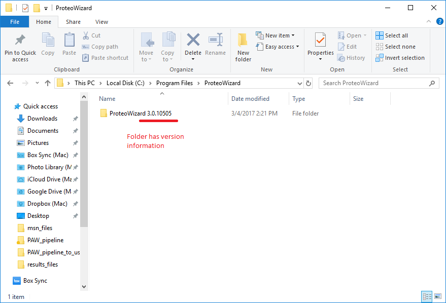
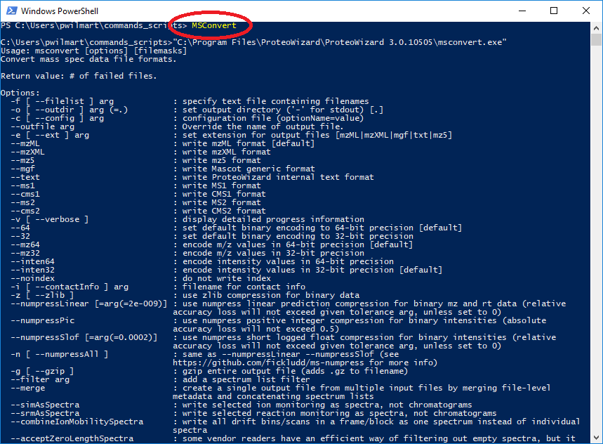

# MSConvert Installation and setup

The `MSConvert.exe` program of the Proteowizard package [1, 2] is used to read and convert Thermo RAW files into formats that can be used by the PAW pipeline scripts.

The ProteoWizard package is available for Windows systems only (due to use of manufacturer's DLLs [dynamic link libraries]) and can be downloaded [**FROM HERE**](http://proteowizard.sourceforge.net/downloads.shtml).

These days the 64-bit version is typically used and the software installs on the `C:` drive in the `Program Files` folder, in a `ProteoWizard` subfolder.



ProteoWizard is developed using continuous code delivery so the last block of version numbers (the 10505) change frequently. The software does not have an auto-update mechanism and updating the ProteoWizard software a few times a year is a good idea. New installations do not remove old installations. Additional folders will be created inside of the `ProteoWizard` folder with different version numbers. Older versions are not removed from the installed programs in Windows and they can be removed using the *Apps & features* control panel.

One way to decouple Python scripts that need to run installed programs that may get updated frequently, is to create a `.BAT` command file to execute the program. Otherwise, a path variable that points to the latest version of ProteoWizard would have to be updated every time a new version is installed. If a `.BAT` file is in a folder located in the system search path, then the base name of the `.BAT` file can be called by the script (and stay the same), and execution of the current version of the software can be maintained by editing the program path in the `.BAT` file.


<br>
Here are the contents of the `MSConvert.bat` file:
```
"C:\Program Files\ProteoWizard\ProteoWizard 3.0.10505\msconvert.exe" %*
```

<br>
The path in the `MSConvert.bat` file should match the latest installed version of `ProteoWizard`. The full path to the executable file is inside double quotes because of the spaces in folder names. The `%*` at the end of the line passes any batch command line arguments on to the `MSConvert.exe` program. The `commands_scripts` folder contains batch files and some other utilities and has been added to the system search path. Any batch files located here can be executed from any Windows Command or PowerShell window, or be called from scripting languages like Python. For instructions on how to add a folder to the system path in Windows 10 see [**THIS LINK**](https://stackoverflow.com/questions/44272416/how-to-add-a-folder-to-path-environment-variable-in-windows-10-with-screensho).

When everything is in place, you can test the the `MSConvert.bat` file can be found by Windows. Open a  Command or PowerShell window (SHIFT-RIGHT-CLICK on a folder to open a shell window with the default location set to the folder) and type `MSconvert` at the prompt. You will get a lengthy usage message if everything is working correctly.



<br>
## References

[1] Kessner, D., Chambers, M., Burke, R., Agus, D. and Mallick, P., 2008. ProteoWizard: open source software for rapid proteomics tools development. Bioinformatics, 24(21), pp.2534-2536.

[2] Chambers, M.C., Maclean, B., Burke, R., Amodei, D., Ruderman, D.L., Neumann, S., Gatto, L., Fischer, B., Pratt, B., Egertson, J. and Hoff, K., 2012. A cross-platform toolkit for mass spectrometry and proteomics. Nature biotechnology, 30(10), p.918.
