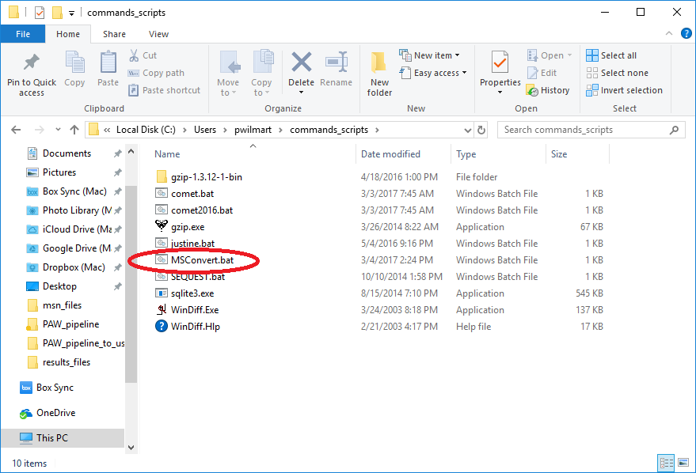

# MSConvert Installation and setup

The `MSConvert.exe` program of the Proteowizard package (reference below) is used to read and convert Thermo RAW files into formats that can be used by the PAW pipeline scripts.

> Chambers, M.C., Maclean, B., Burke, R., Amodei, D., Ruderman, D.L., Neumann, S., Gatto, L., Fischer, B., Pratt, B., Egertson, J. and Hoff, K., 2012. A cross-platform toolkit for mass spectrometry and proteomics. Nature biotechnology, 30(10), p.918.

The ProteoWizard package is available for Windows systems only (due to use of manufacturer's DLLs [dynamic link libraries]) and can be downloaded [**from here**](http://proteowizard.sourceforge.net/downloads.shtml).

These days the 64-bit version is typically used and the software installs on the `C:` drive in the `Program Files` folder, in a `ProteoWizard` subfolder.


ProteoWizard is developed using continuous code delivery so the last block of version numbers (the 10505) change frequently. Updating the ProteoWizard software a few times a year is a good idea. New installations do not remove old installations. Additional folders will be created inside of the `ProteoWizard` folder with different version numbers. Older versions are not removed from the installed programs in Windows and they can be removed using the *Apps & features* control panel.

One way to decouple Python scripts that need to run installed programs that may get updated frequently, is to create a `.BAT` command file to execute the program. If the `.BAT` file is in a folder located in the system search path, then the `.BAT` file can be called by the script, and the current version of the software can be maintained by editing the program path in the `.BAT` file.




Here is the contents of the `MSConvert.bat` file
```
"C:\Program Files\ProteoWizard\ProteoWizard 3.0.10505\msconvert.exe" %*
```

The path in the `MSConvert.BAT` file should match the latest installed version of `ProteoWizard`. For instructions about how to add a folder to the system path in Windows 10 see [**this link**](https://stackoverflow.com/questions/44272416/how-to-add-a-folder-to-path-environment-variable-in-windows-10-with-screensho).
