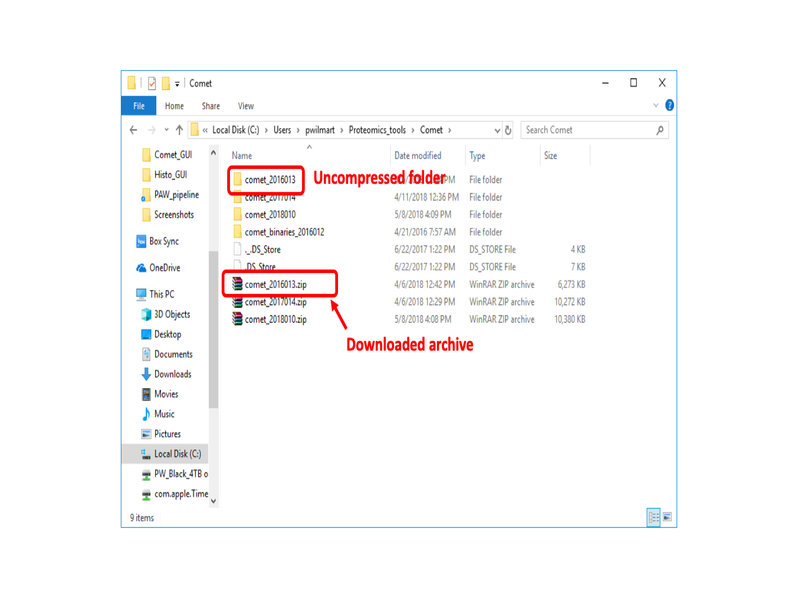
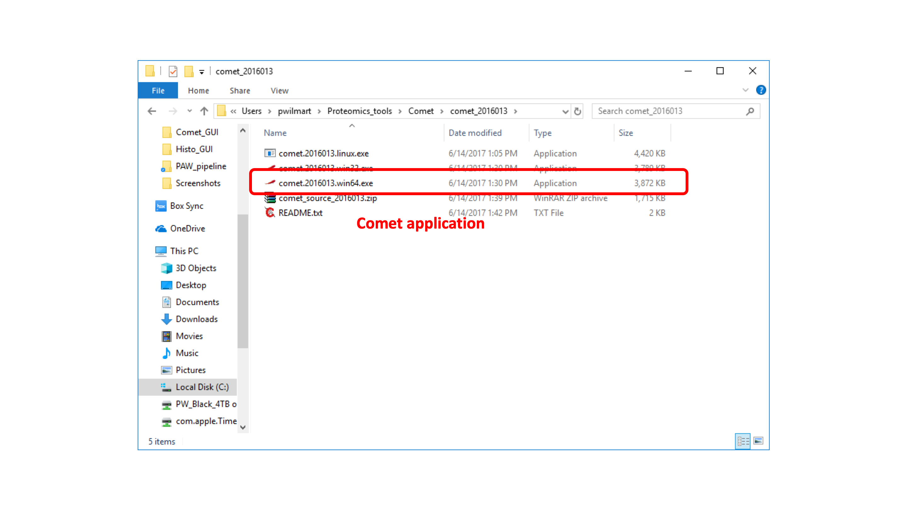
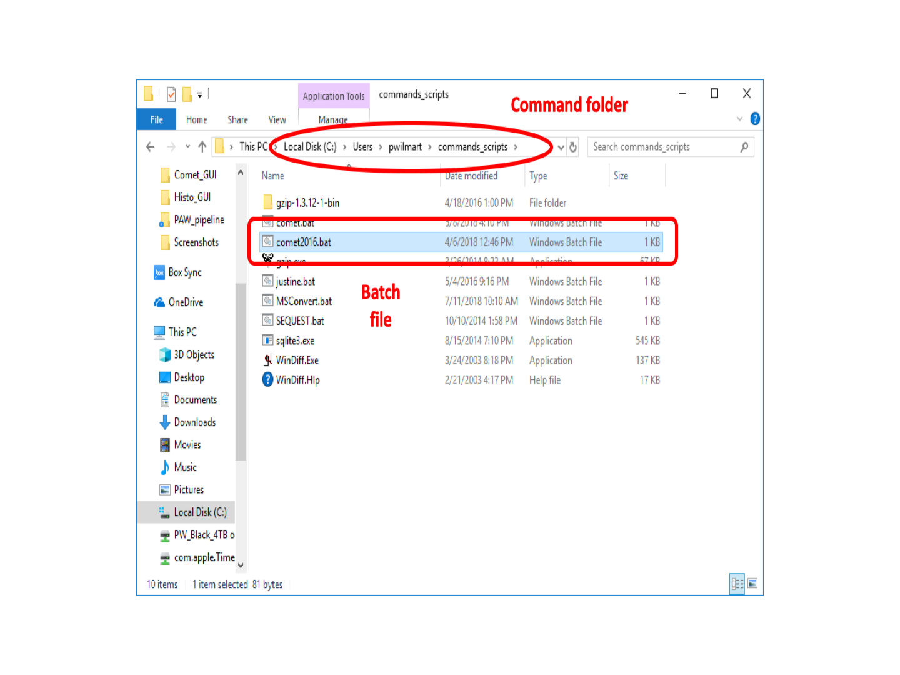
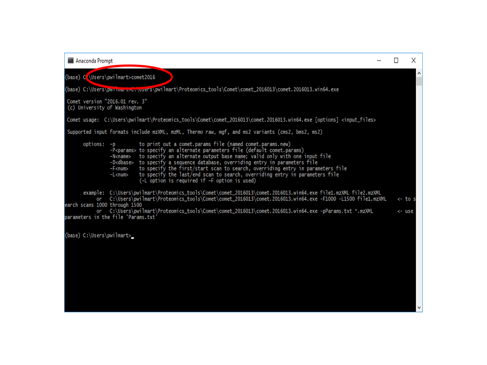

# Comet installation and setup

Comet (**[Ref-1](#ref1)**) is an open source search engine written by Jimmy Eng at the University of Washington. Jimmy authored one of the first and arguably best search engines, SEQUEST (**[Ref-2](#ref2)**), and is a principle scientist at the [UW Proteomics Resource](http://proteomicsresource.washington.edu/).

---

## Download and Set Up

The project is [hosted at SourceForge](http://comet-ms.sourceforge.net/) and the downloads page is located [**_>> HERE <<_**](https://sourceforge.net/projects/comet-ms/files/).

> **NOTE:** The format for describing PTMs in peptide strings changed after the 2016, version 3 Comet. The PAW pipeline has not yet been updated to support the newer format. **PLEASE DOWNLOAD "comet_2016013.zip".**

Comet binaries download as `.ZIP` archives and will need to be located in an appropriate folder and the `.ZIP` archive uncompressed. Here, the folder was called "Proteomics_tools" and that folder is in the Windows search PATH ([see below](#PATH)).




Here are the contents of the uncompressed folder:



---

## Define a `Comet` command

Comet undergoes occasional updates and bug fixes. One way to isolate the PAW Python scripts from the desired Comet version, is to have a BATCH file point to the desired Comet executable file. If a `.BAT` file is in a folder located in the system search path, then the base name of the `.BAT` file can be called by the script (and stay the same), and execution of the current version of the software can be maintained by editing the program path in the `.BAT` file.



Here are the contents of the `Comet.bat` file:
```
C:\Users\pwilmart\Proteomics_tools\Comet\comet_2016013\comet.2016013.win64.exe %*
```

---

<a id=PATH></a>

## Add command folder to Windows system PATH

The path in the `Comet.bat` file should match the latest installed version of `Comet`. The `%*` at the end of the line passes any batch command line arguments on to the `comet.2016013.win64.exe` program. The `commands_scripts` folder contains batch files and some other utilities and has been added to the system search path. Any batch files located here can be executed from any Windows Command or PowerShell window, or be called from scripting languages like Python. For instructions on how to add a folder to the system path in Windows 10, follow [**THIS LINK**](https://stackoverflow.com/questions/44272416/how-to-add-a-folder-to-path-environment-variable-in-windows-10-with-screensho).

When everything is in place, you can test the the `Comet.bat` file can be found by Windows. Open a  Command or PowerShell window (SHIFT-RIGHT-CLICK on a folder to open a shell window with the default location set to the folder) and type `Comet` at the prompt. You will get a usage message if everything is working correctly.



---

## References

<a id=ref1></a>
[1] Eng, J.K., Jahan, T.A. and Hoopmann, M.R., 2013. Comet: an open‐source MS/MS sequence database search tool. Proteomics, 13(1), pp.22-24

<a id=ref2></a>
[2] Eng, J.K., McCormack, A.L. and Yates, J.R., 1994. An approach to correlate tandem mass spectral data of peptides with amino acid sequences in a protein database. Journal of the American Society for Mass Spectrometry, 5(11), pp.976-989.
