# comet_GUI.py script

This script calls the open source search engine [Comet](http://comet-ms.sourceforge.net/) written by SEQUEST author Jimmy Eng. Installation instructions can be found [here](Comet.md).

> Eng, J.K., Jahan, T.A. and Hoopmann, M.R., 2013. Comet: an open‐source MS/MS sequence database search tool. Proteomics, 13(1), pp.22-24.

> Eng, J.K., McCormack, A.L. and Yates, J.R., 1994. An approach to correlate tandem mass spectral data of peptides with amino acid sequences in a protein database. Journal of the American Society for Mass Spectrometry, 5(11), pp.976-989.

The software makes use of the [tkinter](https://docs.python.org/3/library/tk.html) graphical user interface (GUI) included in the Python standard library to allow the user to set some common Comet parameters and launch the searches.

### Step-by-step Example, continued

This is analysis of a public dataset (PRIDE [PXD002875](https://www.ebi.ac.uk/pride/archive/projects/PXD002875)) from Paulo, O'Connell, Gaun, and Gygi:

> Paulo, J.A., O’Connell, J.D., Gaun, A. and Gygi, S.P., 2015. Proteome-wide quantitative multiplexed profiling of protein expression: carbon-source dependency in Saccharomyces cerevisiae. Molecular biology of the cell, 26(22), pp.4063-4074.

There were 24 RAW files of yeast grown in three different carbon sources. It was a 3x3 (9-plex) TMT experiment done with the SPS MS3 (MultiNotch) method.

**The script's workflow is:**
- select the protein database FASTA file
- set parameters
- [optional] change static modifications
- save comet.params file
- run `Comet` searches and summarize results (top hits)

**NOTE:** The current pipeline software still uses the older format for specifying modifications (special characters) instead of the newer delta-mass format. The highest Comet version supported is the [2016.01 revision 3 release](http://comet-ms.sourceforge.net/release/release_201601/).

An easy way to decouple the script code from the specifics of which Comet version is being run is to create a Windows batch file and have that point to the specific Comet version we want. The instructions [**here**](Comet.md) detail creating a `comet2016` batch command that the script calls.

---

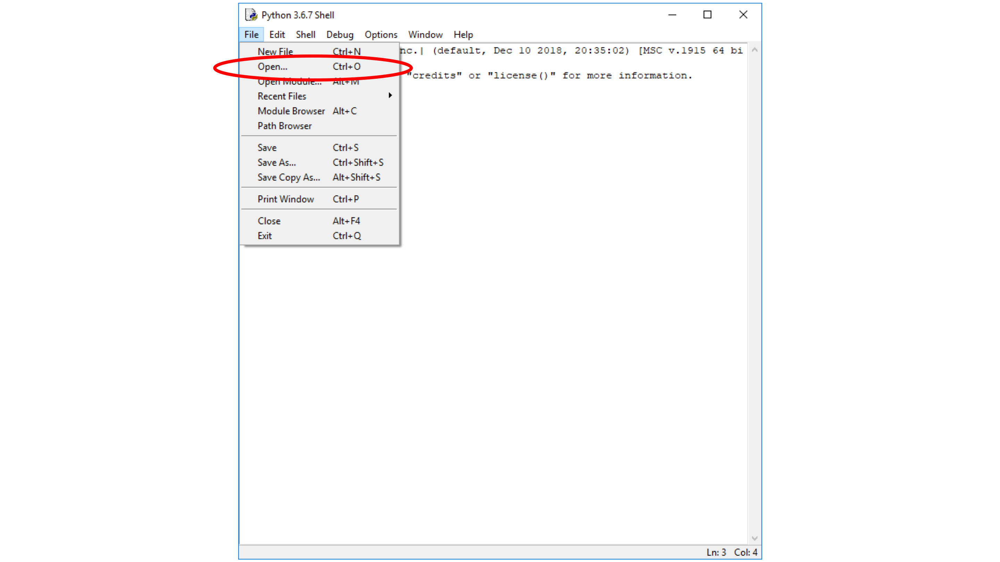

Make sure that you have launched IDLE and that it is running Python 3.

---

Open the `comet_GUI.py` script in IDLE.

---

And run the script.

---

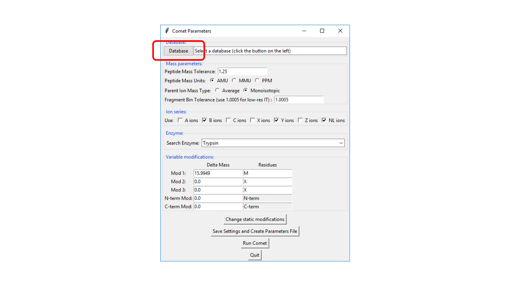

The main GUI window has some of the Comet parameters presented to accommodate basic searches. Comet has many available [parameters](http://comet-ms.sourceforge.net/parameters/parameters_201801/) for more advanced applications. One of the first parameters that needs to be taken care of is the protein FASTA database file. Click the `Database` button to browse to the desired protein database file.

## Aside: Protein Databases

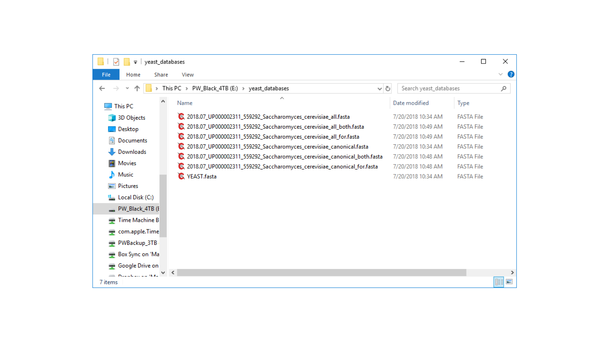

I created a new folder to hold some yeast databases that I could keep in the drive where I dowloaded this public data. I used the `UniProt_reference_proteome_manager.py` script from the [fasta_utilities](https://github.com/pwilmart/fasta_utilities) collection to get recent protein databases for yeast from UniProt. The "_all" or "_canonical" denote whether there are isoforms ("all") or not ("canonical"). The "_for" is added if common contaminants are included with the yeast sequences. The "_both" indicates that common contaminants and sequence-reversed decoys have been added to the yeast sequences.

---

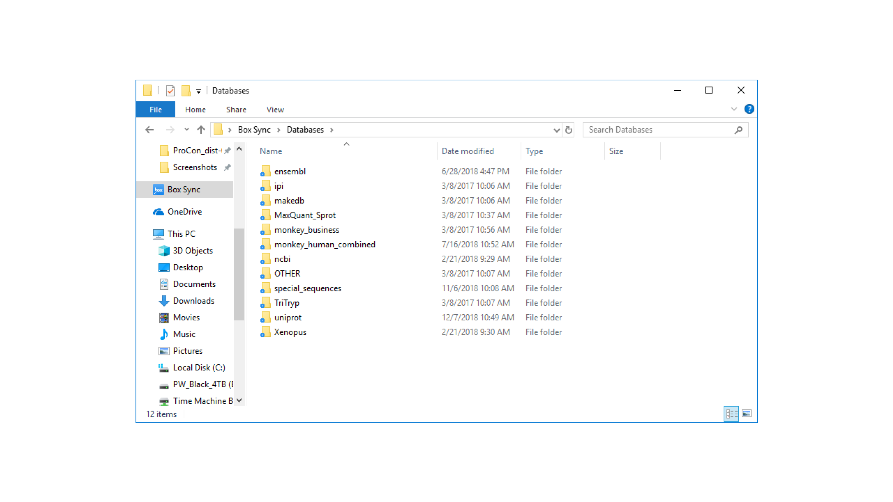

More generally, we have a `Databases` folder on sync system where we keep protein FASTA databases for our [Core facility](https://www.ohsu.edu/xd/research/research-cores/proteomics/). When new databases are added, they sync to all of our analysis computers. We occasionally use Ensembl and NCBI databases, but mostly we use UniProt databases. We have subfolders for the major database sources (above).

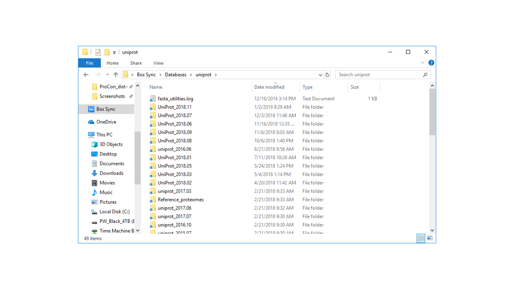

Here is the contents of the UniProt subfolder (above). The `UniProt_reference_proteome_manager.py` script takes care of naming folders by UniProt releases and organizes files inside of the folders.

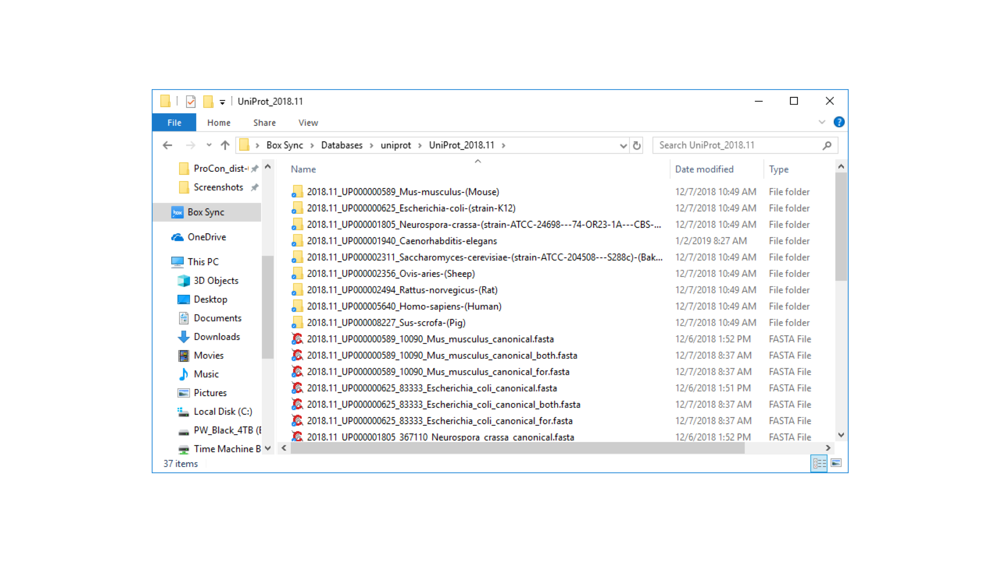

There are many FASTA files available for thousands of species at UniProt. For each one, there are the dowloaded files and the processed files (with or without isoforms, with or without contaminants, with or without decoys, etc.). Keeping all of these organized (above) is why a script was created. Think scripting when something is overwhelming and tedious.

**_Back to our regularly scheduled programming..._**

---

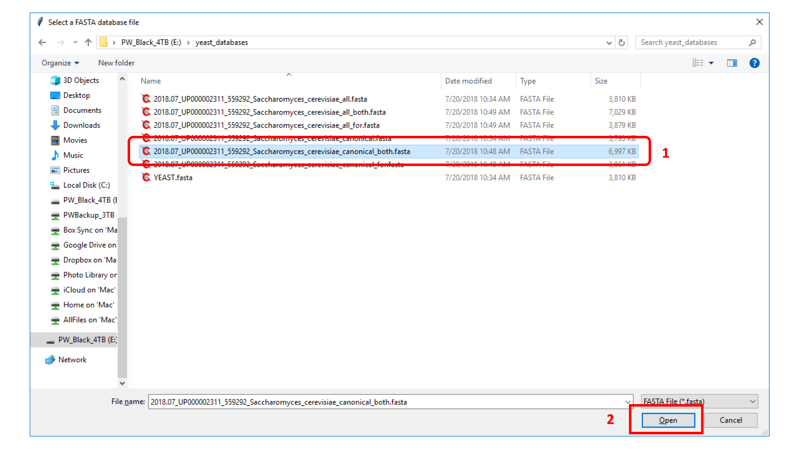

Select the canonical yeast database with decoys. We need decoy sequences for the FDR analysis in the next pipeline step. Comet has support for internally created decoys. We are not using that feature. Reversed decoys work well for wider tolerance searches.

---

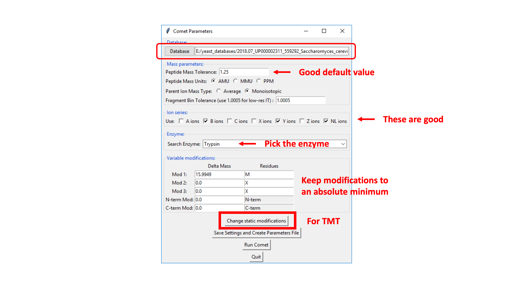

Several of the Comet parameters have sensible defaults set. In order for an accurate mass to be effective at discriminating between correct and incorrect matches, we need to allow incorrect matches to have inaccurate masses. That is why the parent ion tolerance defaults to 1.25 Da. We will see that this naturally takes care of deamidation and isotopic peaks, so we do not have to specify any search parameters for those situations. For data where CID and the ion trap was used for the fragment ions, the fragment ion tolerance of 1.0005 is optimal. **For instruments like Q-Exactives, the saved comet.params should be edited to specify the correct fragment ion settings for high mass accuracy fragment ions.** The ion series defaults should cover most experiments. Comet supports 10 enzyme choices. Trypsin is the default.

Modifications have variable oxidation of methionine and static alkylation of cysteine set as defaults. Keeping modifications to a minimum is recommended. The next pipeline step does FDR explicitly for each modification, so more than one or two variable modifications can be problematic. Some improvements in the pipeline logic need to be done to accommodate more complicated searches. For the time being, try to keep it simple.

TMT tags are best specified as static modifications. Press the `Change static modifications` button to set those.

---

The static modification are shown in a new window. The +57 for Cys can be seen. There is a button for TMT tags so you do not have to remember the accurate masses of the reagents.

---

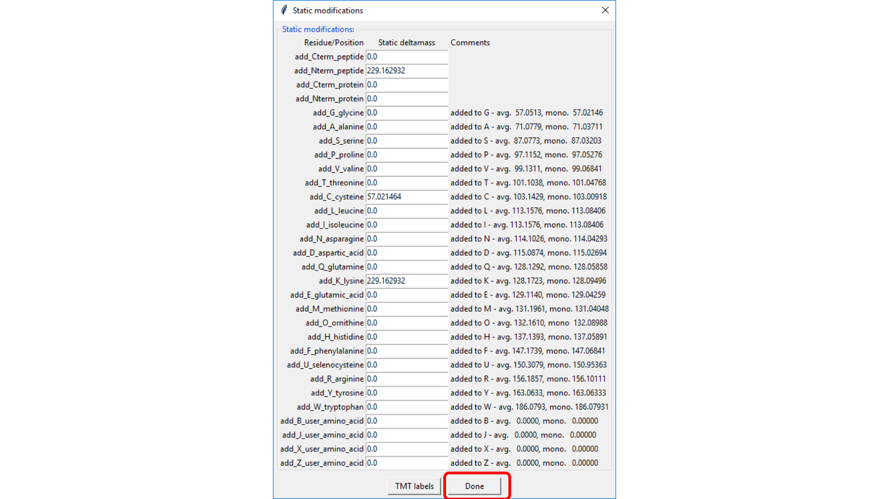

The `TMT lables` button specifies the +229 mass shift for lysine and the peptide N-terminus. Press the `Done` button when everything is set.

---

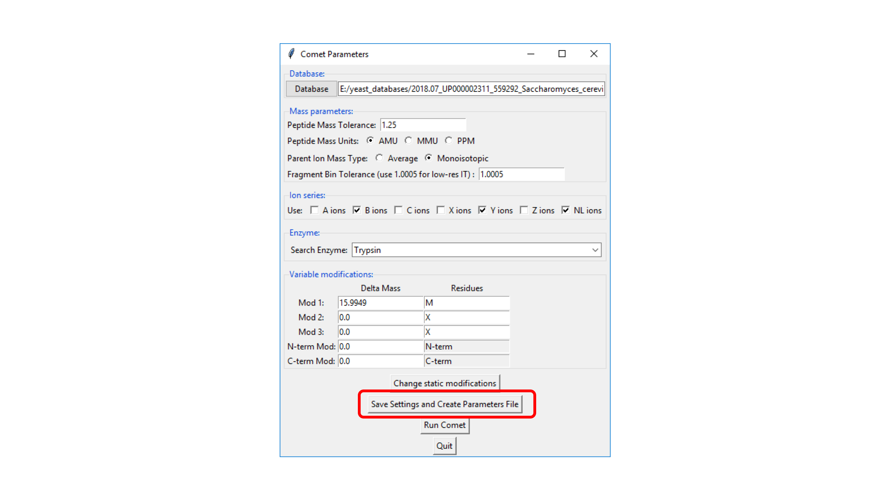

When Comet executes, it reads a `comet.params` file. We need to create one with our parameter choices before we can run the searches. The file needs to be in the folder with the data files (`.ms2` files). Clicking the `Save Settings and Create Parameters File` will do what it says.

---

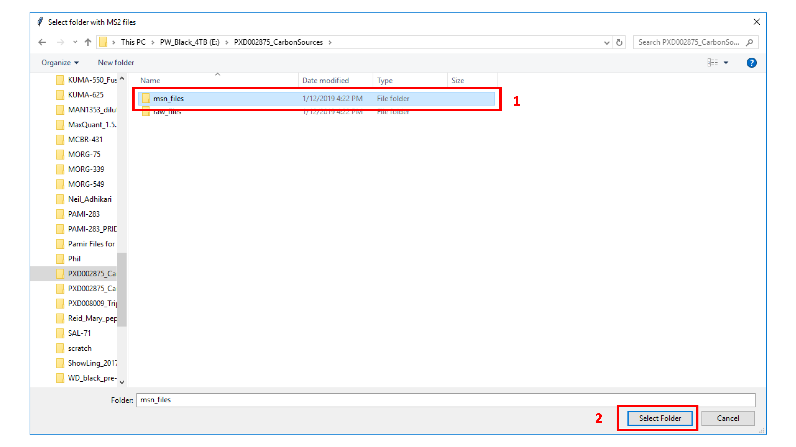

A dialog box will appear to let us browse to the `msn_files` folder. Browse to the folder, select the folder, and click the `Select Folder` button.

---

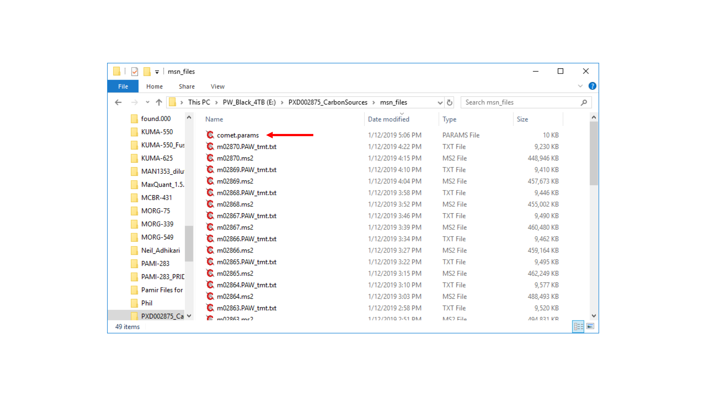

A comet.params file will be written to the `msn_files` folder. That file can be edited to change any of the other Comet parameters that the GUI kept hidden. Comet has many user adjustable [parameters](http://comet-ms.sourceforge.net/parameters/parameters_201801/).

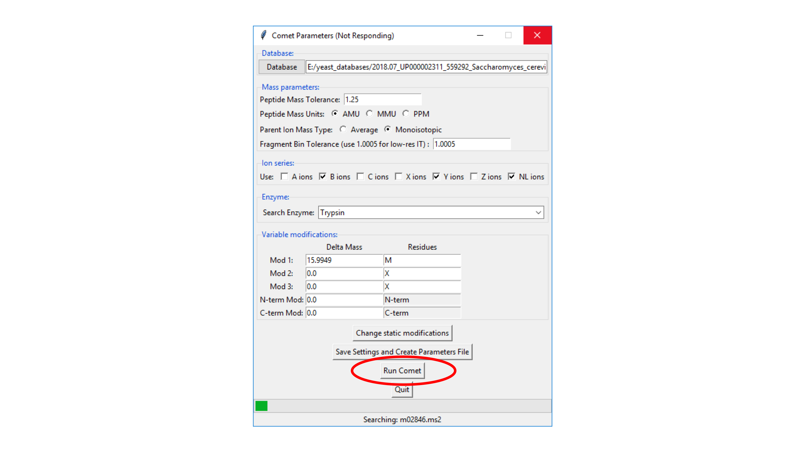

There are some different ways to launch the Comet searches. If the comet.params file is ready to go (you can go and edit it after it has been written but before starting the searches) and you have [defined a `comet2016` command](Comet.md), then you can press the `Run Comet` button. The status bar will show progress. Comet will be running via Windows command shells that appear and disappear in the task bar. There is no IDLE console output during the searches.

---

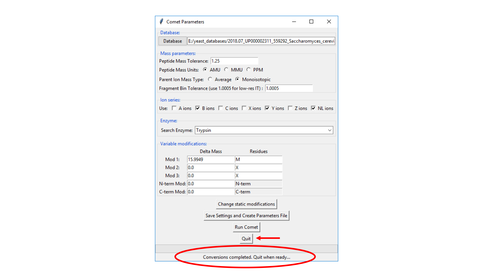

When the searches have finished, the top hit summary conversion step begins. The `sqt_converter.py` script gets launched to read the `.sqt` files created by Comet and extract the top scoring matches. The status bar will say that conversions are starting. When the conversions are completed, the status bar changes to indicate that the conversions are done. Click the `Quit` button to close the GUI window.

---

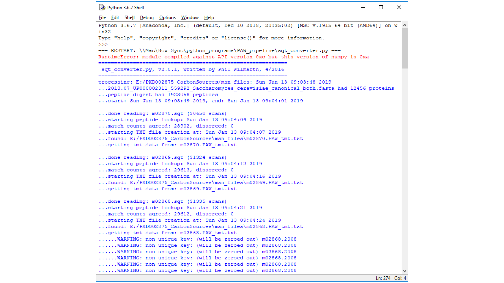

There is IDLE console output during the conversion process. Peptides are matched to protein sequences by first theoretically digesting the FASTA sequences and storing all of the peptides in a big dictionary for lookup. That can take a few minutes to set up. The conversions of each `.sqt` file should be pretty quick.

---

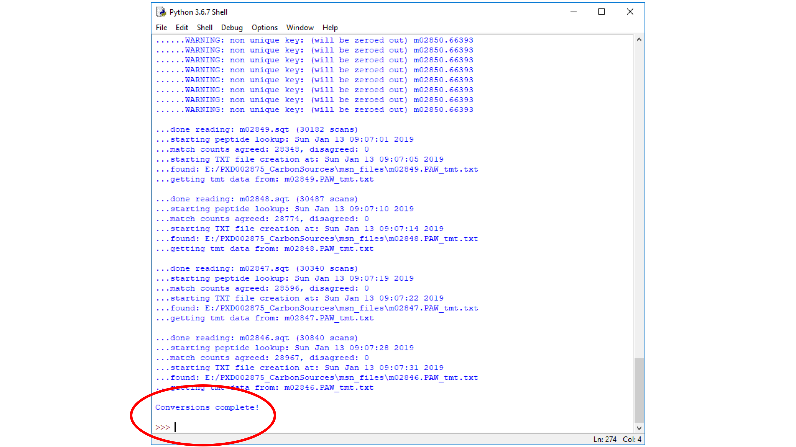

The console window also lets you know that conversions have finished.

## Running Comet via Command Line

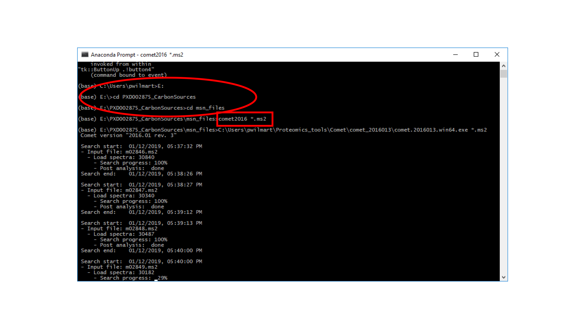

There are times when it is nice to be able to run the Comet searches without using the GUI application. Like when you set a parameter incorrectly, then fix the comet.params file, and want to redo the searches. We need a Windows OS command shell window. It can be a CMD window, a PowerShell window, or the Anaconda prompt window. It is easier to navigate to the folder with the `.ms2` files using `cd` commands (remember Windows supports tab completion). When you are in the correct folder, type the `comet2016 *.ms2` command and press return. That should execute Comet searches for all of the `.ms2` files. There will be some console output as the Comet searches run.

### Aside: setting up the `comet2016` command

See the [installation notes](Comet.md) for Comet for more details.

We can create a `comet2016.bat` in a folder that is in the `PATH` environmental variable. Files with `.bat` extensions are executable in Windows (like `.exe` files).

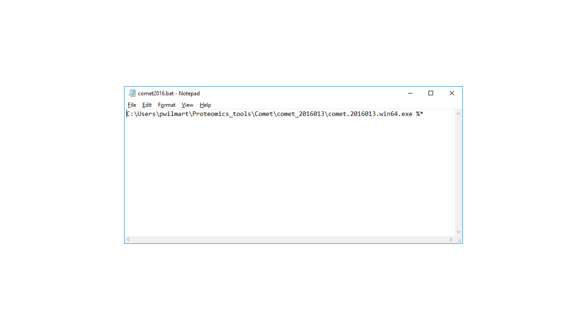

Above is the contents of the batch file. It points to the `comet2016013.win64.exe` compiled program and passes along any other command line arguments.

### Aside end

---

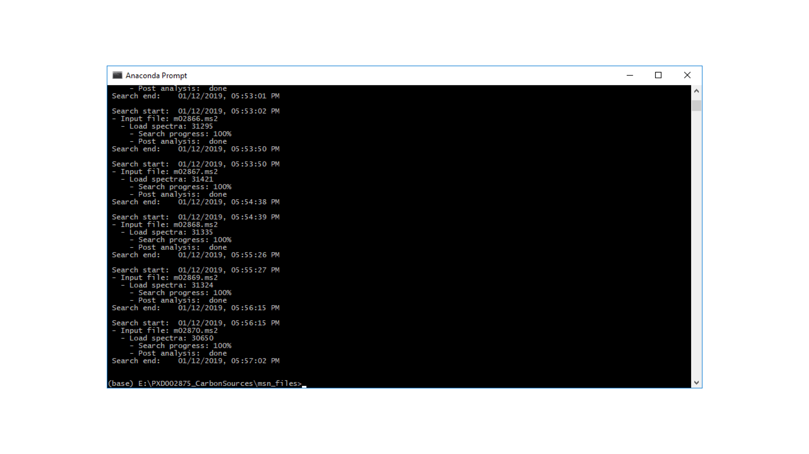

When Comet finishes, we will get the Windows command prompt back.

---

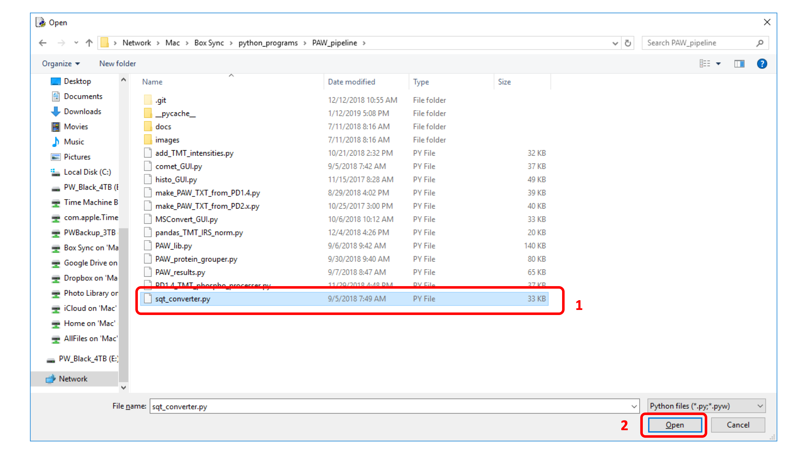

We have to also redo the top hit summary files by running the `sqt_converter.py` script. Open the script in an IDLE code window.

---

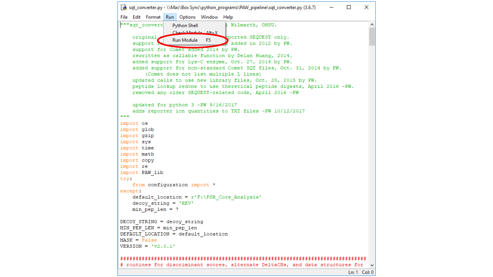

Run the script.

---

The script will ask you to select all of the `.sqt` files to be converted. The `.sqt` files contain information about the protein FASTA file location, so browsing to the FASTA file is not necessary.

---

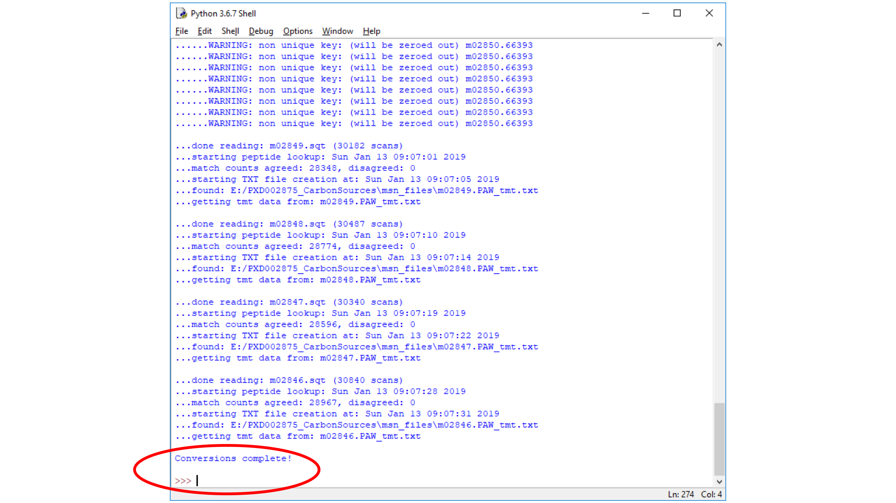

The IDLE console output will look familiar and say when the conversions are done.

---

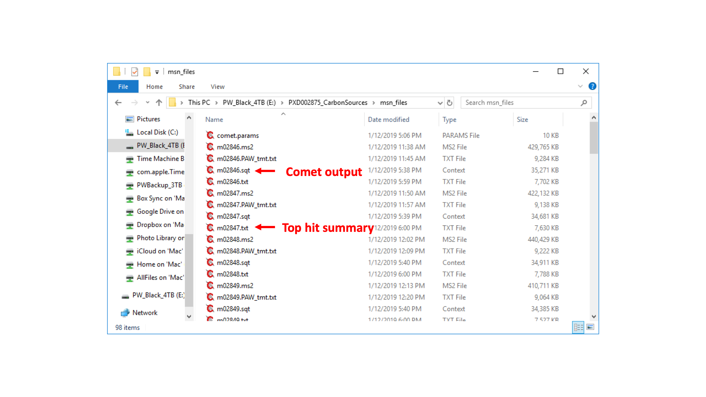

There will be new files in the `msn_files` folder. The `.sqt` files are the Comet results (they are text files, as are the `.ms2` files, if you want to examine them), the `.txt` files with the same base names as the `.sqt` files are the top hit summary files. They are tab-delimited text tables that can be opened in editors or spreadsheet programs.

Next Step: [setting thresholds with histo_GUI](histo_GUI.md)
