# msconvert_GUI.py script

This script uses the open source instrument file reading software [MSConvert](http://proteowizard.sourceforge.net/tools/msconvert.html) from the [Proteowizard](http://proteowizard.sourceforge.net/) suite. Installation instructions and documentation can be found [here](MSConvert.md).

The software uses the graphical user interface (GUI) bundle [tkinter](https://docs.python.org/3/library/tk.html) included in the Python standard library to allow the user to select the RAW files to convert, set some noise filters, and specify the type of data. File organization and naming are done automatically.

**The script's workflow is:**
- select RAW Files
- [optional] change parameters
- pick data type
- perform conversions

---

## Setup

The script needs to know how to launch the MSConvert command on your Windows computer. Proteowizard is managed using continuous integration and new versions appear regularly. There is not a formal major version scheme (I think) with a release schedule. I download new versions quarterly (or when I remember to do so). New versions install to a new folder (which contains version information).

This means that the path for the MSConvert.exe application changes every time you update the software. There are several ways to deal with this. The one I use is to create a Windows batch file called "MSConvert.bat" that points to the latest version of the Proteowizard tools. I have a "commands_scripts" folder that contains this batch file and a few others. That folder is in my Windows system PATH variable. The [installation information](MSConvert.md) for MSConvert has details. This lets the script execute a system call to run "MSConvert" and that will execute whatever MSConvert.exe that the batch file points to.

You can also edit the script to explicitly execute the MSConvert.exe application. The lines are in the `start_processing` method of the `MSConvertGUI` class. Look for the "# call MSConvert" comment line.

---

## Project organization

The PAW pipeline uses a subfolder organization scheme to keep track of files and spare the user some housekeeping chores. For a given analysis project, there should be a formal "project folder" created. Our core assigns project codes (a mashup of PI name and project number) and we use those as folder names. You may have some other method to your madness. You will need to create a folder for an analysis that will contain all of the analysis files. There should be a subfolder called `raw_files` created to contain the  Thermo instrument RAW files to be analyzed.

**Organization Scheme:**
- create a project folder
- create a `raw_files` folder in the project folder
- copy RAW files to the `raw_files` folder

---

## Step-by-step Example

This is analysis of a public dataset (PRIDE [PXD002875](https://www.ebi.ac.uk/pride/archive/projects/PXD002875)) from Paulo, O'Connell, Gaun, and Gygi:

> Paulo, J.A., O’Connell, J.D., Gaun, A. and Gygi, S.P., 2015. Proteome-wide quantitative multiplexed profiling of protein expression: carbon-source dependency in Saccharomyces cerevisiae. Molecular biology of the cell, 26(22), pp.4063-4074.

There were 24 RAW files of yeast grown in three different carbon sources. It was a 3x3 (9-plex) TMT experiment done with the SPS MS3 (MultiNotch) method:

> McAlister, G.C., Nusinow, D.P., Jedrychowski, M.P., Wühr, M., Huttlin, E.L., Erickson, B.K., Rad, R., Haas, W. and Gygi, S.P., 2014. MultiNotch MS3 enables accurate, sensitive, and multiplexed detection of differential expression across cancer cell line proteomes. Analytical chemistry, 86(14), pp.7150-7158.

---

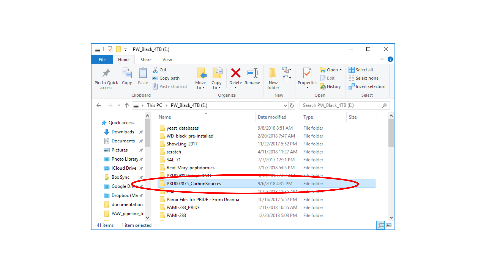

I have created a `PXD002875_CarbonSources` project folder.

---

In that folder, I have created a `raw_files` subfolder.

---

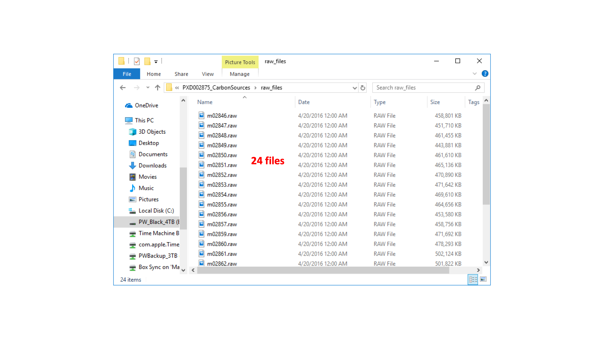

The `raw_files` folder contains the 24 downloaded `.raw` files.

---

The script uses some Python libraries that are not part of the standard library. These are commonly referred to as the [scientific Python stack](https://www.scipy.org/about.html). The easiest way to manage that is to use the [Anaconda](https://www.anaconda.com/) Python distribution. Installation instructions can be found [**>>HERE<<**](Anaconda.md).

I refuse to apologize for liking the builtin development environment in Python called [IDLE](https://docs.python.org/3/library/idle.html) and recommend using IDLE to launch Python scripts. Start an Anaconda command prompt window.

---

In the command, window type `idle` and press return. (NOTE: you may have to specify a specific Python version depending on what is installed on your system, such as `idle3`.) This will launch the IDLE environment. IDLE has a console window called the `Shell` window that will open upon launch. It will tell you the version of Python that it is running.

---

You need to open the script file in order to run it from IDLE. Select the `Open...` command from the `File` menu.

---

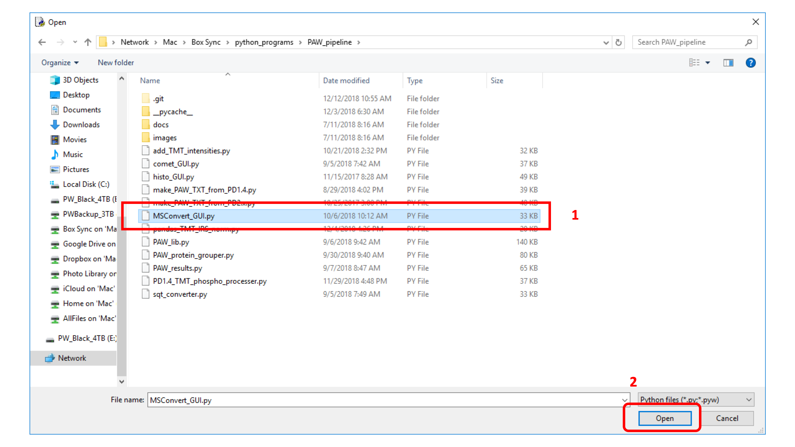

Select the `msconvert_GUI.py` script using the file dialog box, then click the `Open` button in the lower right corner.

---

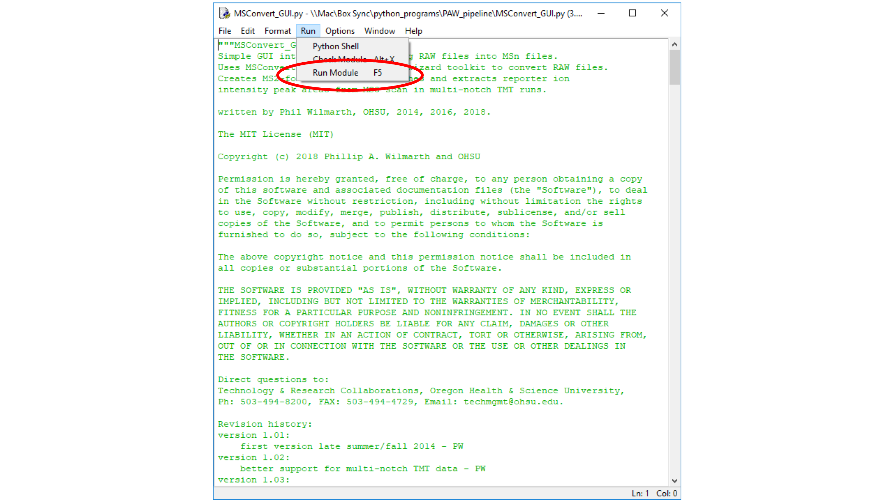

A new code editing window will open in IDLE. The window has color-coded syntax highlighting, tab completion, and standard editing functionality. Execute the script by selecting the `Run Module` command from the `Run` menu. Pressing the F5 function key is a shortcut.

---

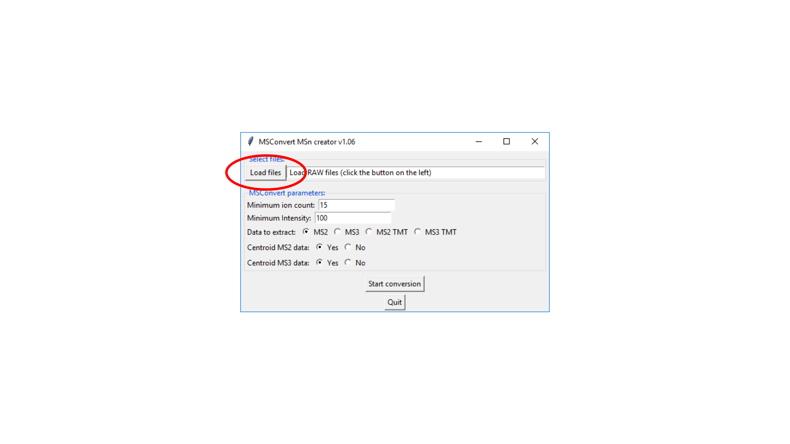

The GUI application window is not very large. It (hopefully) opens as a top window and you can find it. The first thing to do is to select the `.raw` files to process. Press the `Load files` button in the upper left of the window.

---

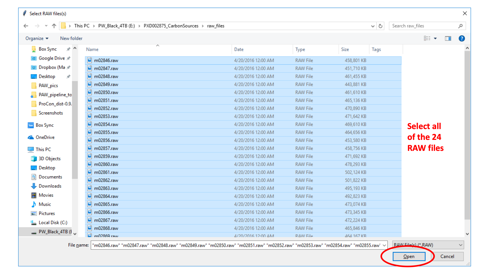

This brings up the standard file dialog box. Perform a multiple file selection of all of the `.raw` files to be processed (24 for this example). Then click the `Open` button.

---

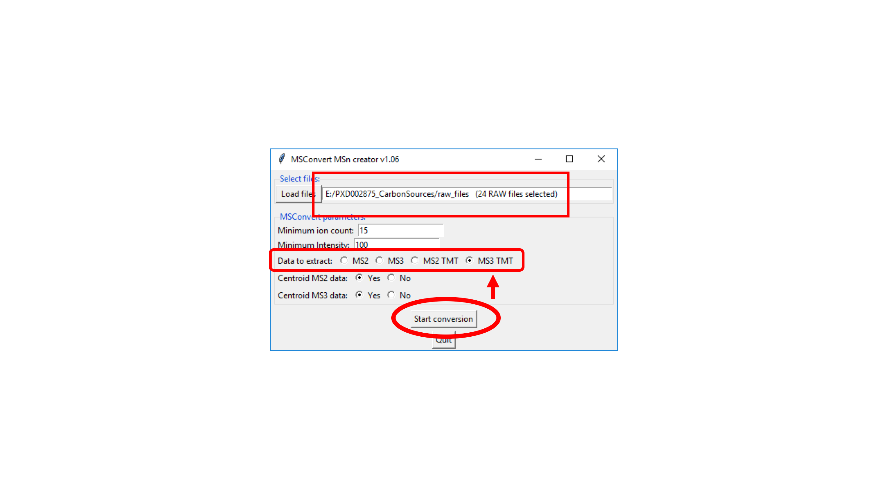

The text field next to the `Load files` button should have a summary of your file selection. There are a couple of parameter settings (`Minimum ion count` and `Minimum Intensity`) with very generous settings. These will skip some very poor quality scans and do not usually need to be changed.

The `Data to extract` set of radio buttons are very important. This tells the application what kind of data it is processing, and what output files to create. This data is MS3 TMT. We will have linked MS2 and MS3 scans. The y- and b-ion information will be in the ion trap MS2 scans and the reporter ion information will be in the Oribrap MS3 scans. We need files for Comet to use to identify the peptides (MS2 format), and we need to save the reporter ion peak heights in files the pipeline can read later.

> McDonald, W.H., Tabb, D.L., Sadygov, R.G., MacCoss, M.J., Venable, J., Graumann, J., Johnson, J.R., Cociorva, D. and Yates III, J.R., 2004. MS1, MS2, and SQT—three unified, compact, and easily parsed file formats for the storage of shotgun proteomic spectra and identifications. Rapid Communications in Mass Spectrometry, 18(18), pp.2162-2168.

Thermo instruments save centroided data for every scan even if the method specified profile mode data acquisition. The SPS MS3 method has centroided ion trap CID MS2 data and profile mode Orbitrap HCD MS3 data. We can use the centroid option for both.

Press the `Start conversion` button to begin the data processing. The application does not make use of multiple processors, so conversions can take several minutes to hours. MSConvert typically has a large binary file to work through. The converted text format file is also large. This needs to be parsed to get the MS2 scan data and the extract the reporter ions.

---  

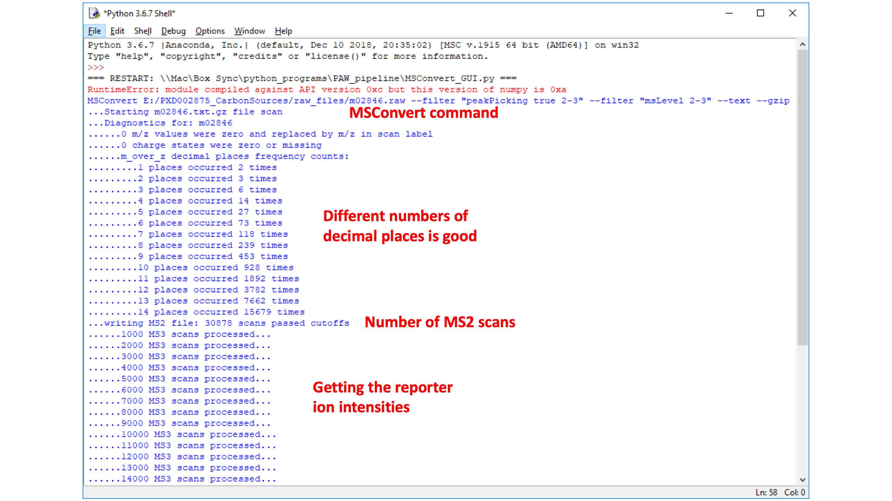

During the processing, the bottom line (the status bar) of the GUI window shows progress. The IDLE console window also logs information during processing.

---

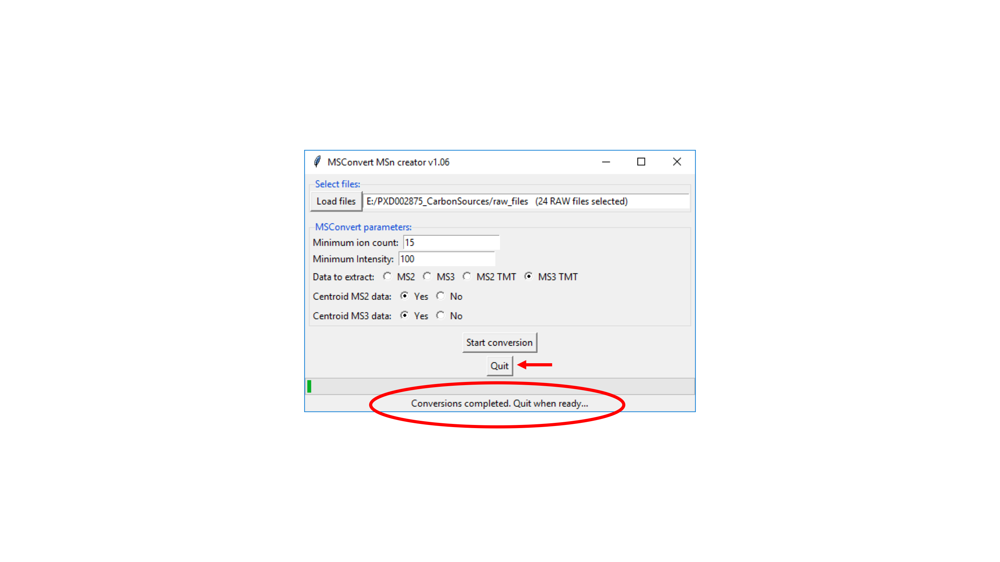

When the GUI status bar indicates that the conversions have completed, the `Quit` button can be pressed.

---

We will also get the Python command prompt (`>>>`) back in the console window after the GUI application has exited.

---

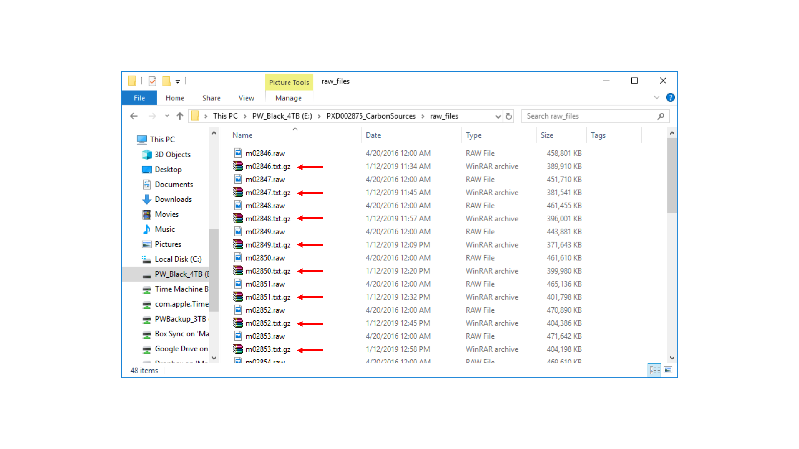

We will see that there are some new files in the `raw_files` folder. These are the text-format files from MSConvert (in compressed form). They can be uncompressed and examined with editors designed for large files (or with command line options).

---

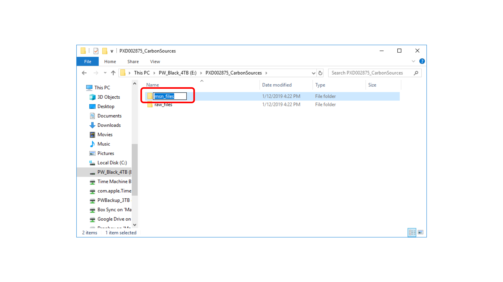

There will also be a new folder created called `msn_files`.

---

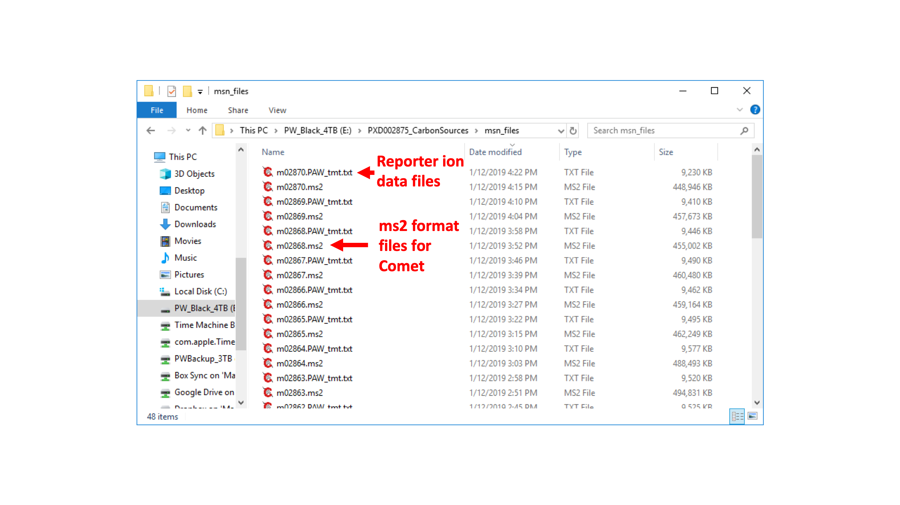

This folder has the files we need for the next step in the PAW pipeline. It has `.ms2` files for used by [Comet](http://comet-ms.sourceforge.net/). The `.PAW_tmt.txt` files have the reporter ion peak height data.

Next Step: [How to run comet_GUI](comet_GUI.md)
